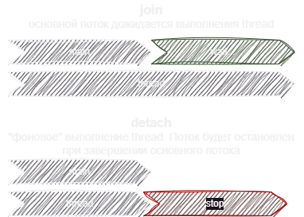

# Механизм создания потоков thread

Стандартное средство создания потока в `C++` класс `thread`.
Чтобы запустить поток необходимо передать в конструктор класса ссылку на фукциональную сущьность. 

## Фоновый процесс или ожидание выполнения

Схематично показана разница `join` и `detach`. 

`join` - блокирует выполнение основного потока 

`detach` - выполняется в фоновом режиме




## Как это выглядит в коде

Мы выполняем функцию worker в N потоках. 
Однако, когда в основном потоке мы выходим за область вимоcти `thread` при вызове деструктора класса происходит проврка для каждого потока на вызов `join` или `detach` в случае отсутсвия получим ошибку.

```cpp
void worker()
{
	…
}

std::thread thr1(worker);
std::thread thr2(worker);
…
std::thread thrN(worker);

/*
Продолжается
выполнение операций
в основном потоке
*/

thr1.join() или thr1.detach()
thr2.join() или thr2.detach()
…
thrN.join() или thrN.detach()
```